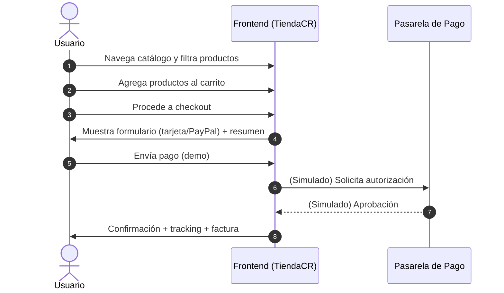

# TiendaCR · Frontend (Persona 2)

Proyecto final ITI-523 — **Frontend listo** con Bootstrap 5, carrito, filtros, proceso de pago (demo), confirmación y factura imprimible.

> **Importante:** Este frontend está listo para integrarse con un backend en PHP/MySQL (Persona 1). Por ahora usa `localStorage` para el carrito y el último pedido confirmado.

## Cómo ejecutar (XAMPP / Apache)

1. Copia la carpeta `tienda-virtual-frontend` dentro de tu carpeta de proyectos de XAMPP, por ejemplo:
   - **Windows:** `C:\xampp\htdocs\tienda-virtual-frontend`
2. Abre `http://localhost/tienda-virtual-frontend/index.php`
3. Recorre las páginas: `products.php`, `cart.php`, `checkout.php`, `confirmacion.php`, `factura.php`

> Si usas GitHub Pages para mostrar el **frontend**: sube toda la carpeta a un repo y habilita Pages (HTTPS). Recuerda que GitHub Pages no ejecuta PHP; úsalo como hosting estático o renombra a `.html` si deseas verlo allí. El backend quedaría en tu XAMPP con HTTPS propio.

## Mapeo a la rúbrica (en lo que aplica a Persona 2)

- ✅ **Catálogo por categorías** (Electrónica, Ropa, Hogar, Viajes) — `products.php`
- ✅ **Lista con detalles** (nombre, precio, descripción, imagen) — `products.php`
- ✅ **Búsqueda y filtrado** (nombre, categoría, precio) — `products.php` + `assets/js/filters.js`
- ✅ **Carrito: agregar, eliminar, actualizar** — `products.php` + `cart.php` + `assets/js/*`
- ✅ **Cálculo automático** (subtotal, IVA 13%, envío, total) — `cart.php`
- ✅ **Pasarela de pago (UI)** con tarjeta y PayPal (demo) — `checkout.php` + validaciones
- ✅ **Confirmación de pedido** con **número de seguimiento** — `confirmacion.php`
- ✅ **Factura** con fecha, pedido, seguimiento, totales e impresión PDF — `factura.php`
- ✅ **Validaciones de entradas** (Luhn, expiración, CVV, términos) — `payment.js`
- ✅ **Seguridad en interfaz** (CSP meta, sanitización DOM, sin inline JS) — ver `security/`
- ✅ **Diseño responsive** (Bootstrap 5) — todas las páginas
- ✅ **Hosting con HTTPS** (GitHub Pages para frontend) — guía incluida
- ✅ **Pruebas unitarias (frontend)** — `tests/test_runner.html`
- ✅ **Documentación** — este README + checklist + diagrama

El resto de puntos (autenticación, historial, base de datos, SSL backend, pruebas backend, etc.) corresponden a **Persona 1**.

## Diagrama (proceso de compra)



## Integración con Backend (sugerida)

- Reemplazar lectura de `assets/js/data/products.json` por endpoint `GET /api/productos`.
- `Cart` podría enviarse en `POST /api/checkout` con los datos del formulario (sin tarjeta en claro) para generar orden real.
- Confirmación: backend devuelve `orderId` y `tracking`. Frontend redirige a `confirmacion.php?id=...`.
- Factura: `GET /api/factura/{orderId}` devolvería PDF/HTML real.

## Estructura

```
tienda-virtual-frontend/
├── assets/
│   ├── css/styles.css
│   ├── img/placeholder.png
│   └── js/
│       ├── app.js, cart.js, config.js, filters.js, utils.js
│       ├── cartPage.js, payment.js, confirmacion.js, factura.js
│       └── data/products.json
├── security/frontend_security_checklist.md
├── tests/test_runner.html
├── index.php
├── products.php
├── cart.php
├── checkout.php
├── confirmacion.php
└── factura.php
```

## Nota sobre datos de pago
Este demo **no** procesa pagos reales ni guarda datos sensibles. Las validaciones son para **interfaz**. El procesamiento seguro debe hacerse en el backend o proveedor (Stripe/PayPal) sobre **HTTPS**.


---
## Activar integración con Backend

1. Edita `assets/js/config.js`:
   - `apiEnabled: true`
   - `baseUrl: ''` si el backend corre en el mismo dominio (XAMPP). O pon tu dominio.
2. Asegura CORS/CSRF si backend y frontend están en dominios distintos.
3. Endpoints esperados:
   - `GET /api/productos` → `[{ id, name, description, price, category, image }]`
   - `POST /api/checkout` → `{ orderId, tracking, date, subtotal, tax, shipping, total }`
     - **Entrada**: `{ method: 'card'|'paypal', items: [{ id, qty }] }`
   - `GET /api/pedidos/{id}` → `{ orderId, tracking, date, total, items:[{ name, qty, price }] }`
   - `GET /api/factura/{id}` → `{ orderId, tracking, date, subtotal, tax, shipping, total, items:[...] }`
